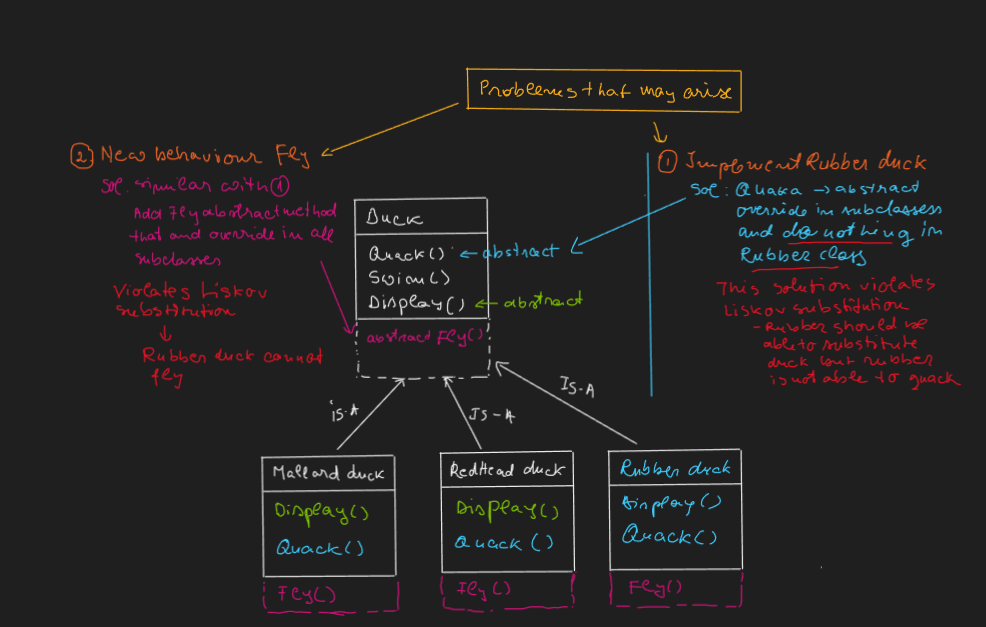
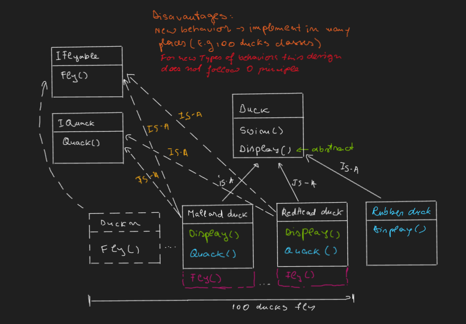
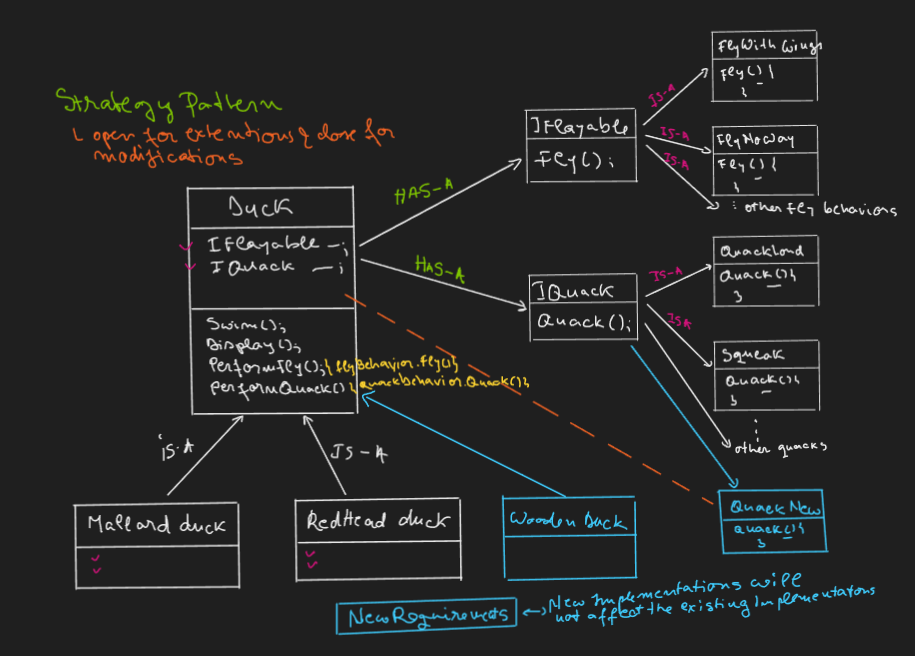
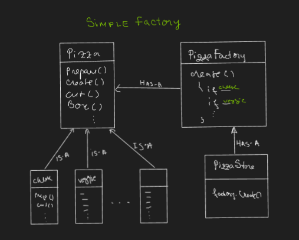
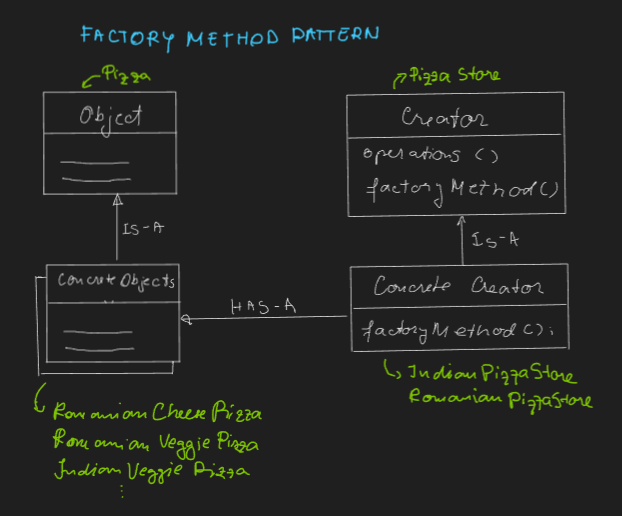
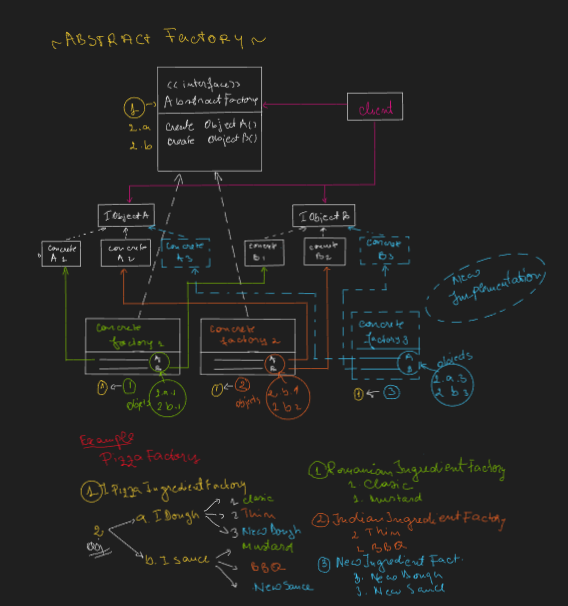

# Design Patterns

## Behavioral

### Strategy

$\mathsf{\color{orange}Definition: \space}$ Family of alghorithms which encapsulates each behavior and make them interchangeble

$\mathsf{\color{lime}Problem \space statement: \space Implement \space Duck \space Simulation \space game}$

### 1. Initial design / implementation:

### $\mathsf{\color{lightgreen}Solution \space 1 \space - \space Simple \space solution}$

- Superclass -> Duck
- Subclasses
  - -> Mallard duck
  - -> RedHead duck

$\mathsf{\color{#458fff}Initial \space design \space limitations}$

### 2. Avoiding violation of SOLID (L):

### $\mathsf{\color{lightgreen}Solution \space 2 \space - \space Use  \space interfaces \space for \space uncommon \space behaviors}$

- Interfaces
  - -> IFlyable
  - -> IQuack
- Superclass -> Duck
- Subclasses
  - -> Mallard duck
    - -> RedHead duck
  - -> Rubber duck

$\mathsf{\color{#458fff}New \space design \space limitations}$

### 3. Strategy pattern implementation HAS-A (Composition) vs Is-A (Inheritance)

## Creational

### The Factory pattern

### 1. Simple Factory - Not a pattern

Initially Pizza class contained Create method responsible to pizza creation (multiple if / else). Pulling out the create method in PizzaFactory class it enable multiple clients to have access to the PizzaFactory

### 2. Factory Method:

$\mathsf{\color{orange}Definition \space \color{orange}1: \space}$ Encapsusulates object creation by letting the subclasses to decide what object

$\mathsf{\color{orange}Definition \space \color{orange}2: \space}$ The factory method pattern defines an interface (abstract method) for creating an object but let the subclasses to decide which class to instantiate

### 3. Abstract Factory:

$\mathsf{\color{orange}Definition: \space}$ Provide an interface for creaating families of related objects without specifying their concrete class

