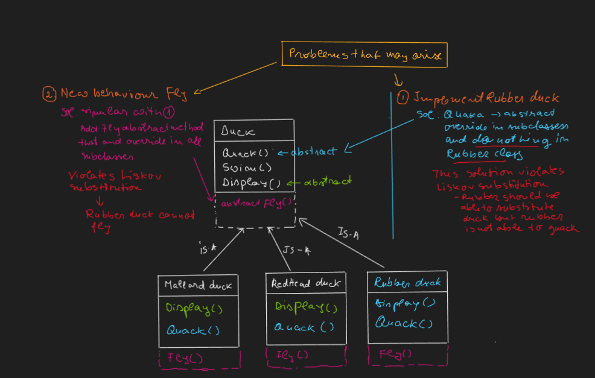

# Design Patterns

## Behavioral
### Strategy
Problem statement: Implement Duck Simulation game

#### 1. Initial design / implementation:
There are n types of duck and each type of duck is a duck ==>

<b style="color:lightgreen">Solution 1 - Simple solution</b>
- Superclass -> Duck
- Subclasses 	
	- -> Mallard duck 		
    - -> RedHead duck

<b style="color:#458fff">Initial design limitations</b>

#### 2. Avoiding violation of SOLID (L):
<b style="color:lightgreen">Solution 2 - Use interfaces for uncommon behaviors</b>
- Interfaces
	- -> IFlyable
	- -> IQuack
- Superclass -> Duck
- Subclasses 	
	- -> Mallard duck 		
    - -> RedHead duck
	- -> Rubber duck

<b style="color:#458fff">New design limitations</b>

#### 3. Strategy pattern implementation HAS-A (Composition) vs Is-A (Inheritance)

## Creational
